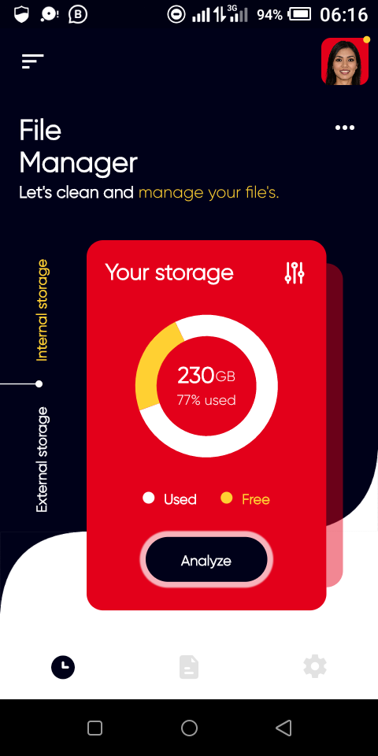

#   File management app

This is a flutter app to implement the design at [File Manager App by Sajon for Fireart Studio on Dribbble](https://dribbble.com/shots/11090326-File-Manager-App)

##  Running the application
***Note! Ensure you device is set-up for flutter development. If not, head over to https://flutter.dev/docs/get-started/install and choose your operating system to get started***

1.  clone this repository to your system
2.  inside the project root run `flutter pub get`  in a terminal
3.  Connect an emulator or physical device(in debug mode)
4.  Run `flutter run` to launch the application

Made with love by @wisdomspine